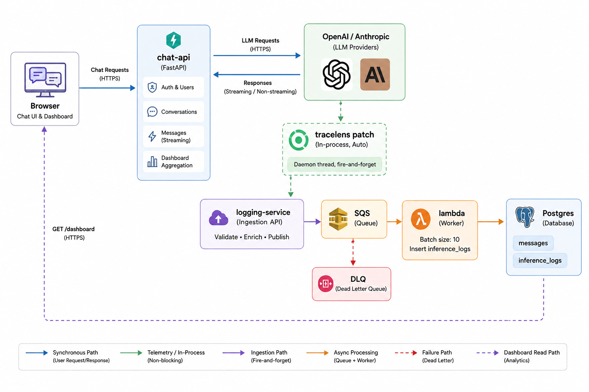

# TraceLens

Two things in one repo:

- **ChatJippity** — a ChatGPT-style chatbot: multi-turn, streaming, conversation history.
- **TraceLens** — the observability around it. An SDK auto-instruments every LLM
  call, ships the metadata to an ingestion service, and a queue-backed worker
  persists it. The app's Dashboard reads it back.

The point of the split: the chat app never knows it is being observed. No call
site in the backend mentions logging, and nothing in the pipeline can slow the
chat down or break it.


---

## Architecture overview

<p align="center">
  
</p>

```
 browser ──▶ chat-api ──▶ OpenAI / Anthropic
                │               │
                │         tracelens patch (in-process, auto)
                │               │  daemon thread, fire-and-forget
                │               ▼
                │       logging-service ──▶ SQS ──▶ lambda ──┐
                │                            │               │
                │                            └──▶ DLQ        ▼
                └───────── GET /dashboard ◀──────────── Postgres
```

The chat path and the observability path share only the database. The chat-api
writes `messages`; the Lambda writes `inference_logs`. Neither writes the
other's table, so a fault anywhere in the pipeline cannot corrupt or delay a
chat turn — the worst case is a missing metric.

The queue is what decouples them: ingestion returns as soon as an event is
accepted, so write rate is independent of request rate and the database can be
down without ingestion failing.

Ingestion flow, logging strategy, scaling and failure handling in detail:
**`ARCHITECTURE.md`**.

---

## The pieces

### `frontend/` — React 18 + TypeScript + Vite

The chat UI and the dashboard.

- Streams replies token by token over SSE, with **stop generating** mid-reply.
- Conversations: list, resume, rename, delete. Created lazily on first send, so
  an abandoned "New chat" leaves no row behind.
- Optimistic updates throughout — messages, renames and deletes apply
  immediately and roll back if the server rejects them.
- Dashboard: call volume, success rate, latency, tokens, per-model breakdown,
  and a 24-hour throughput chart.
- The JWT lives outside React state, so `api/` modules never import the auth
  context.

### `backend/` — FastAPI + async SQLAlchemy + Postgres

The chat API. Routers stay thin (parse, delegate, map errors to status codes);
services own the logic and never import FastAPI.

- Auth: register/login, Argon2id hashing, JWT bearer tokens.
- Chat: one turn = store the user message, call the model with the last N turns,
  store the reply. Streaming and non-streaming both supported.
- **Cancellation**: hitting stop aborts the provider call and stores no reply,
  so a cancelled answer can't reappear on reload.
- **Providers are strategies** — `claude-*` routes to Anthropic, everything else
  to OpenAI. With no API key it falls back to echo mode, so the whole loop is
  testable without spending anything.
- Dashboard aggregation, with cost derived at read time from `pricing.py`.

### `sdk/` — `tracelens`, zero dependencies

Captures the inference metadata. `init()` **monkey-patches the vendor clients**,
so every `openai` and `anthropic` call is traced with no changes at the call
site.

- Records model, provider, latency, token usage, timestamp, status/error,
  conversation id, and input/output previews.
- **Never blocks, never breaks**: events POST from a fire-and-forget daemon
  thread and every transport error is swallowed. A dead collector cannot take
  the app down with it.
- **PII redaction**: only 200-character previews leave the process, with emails,
  phone numbers and card numbers replaced first.
- Streaming is the one case the patch can't measure — `create(stream=True)`
  returns an iterator before any token exists — so the provider reports it with
  `tracelens.record()` once the stream ends.

### `logging-service/` — the ingestion endpoint

FastAPI. Receives events, validates them with Pydantic, publishes to SQS. Holds
no state and never touches the database.

Publish failures are logged and swallowed: the SDK already got its 200, and
observability must not break the app being observed.

### `lambda/` — the worker

Triggered by SQS, batch size 10. Parses each record and inserts one
`inference_logs` row. Messages that fail repeatedly land in a dead-letter queue
instead of blocking the queue. Sample test events are in `lambda/test-events/`.

---

## Endpoints

### Chat API (`backend/`) — all under `/api/v1`

| Method | Path | Auth | Purpose | Returns / notes |
|---|---|:---:|---|---|
| `POST` | `/users/register` | — | Create an account; Argon2id hashes the password | `201` + JWT and user. `409` if the email is taken |
| `POST` | `/users/login` | — | Exchange email + password for a token | `200` + JWT and user. `401` on bad credentials |
| `GET` | `/users/me` | ✔ | Resolve the bearer token to a user | The frontend calls this on boot to validate a stored token |
| `POST` | `/users/logout` | ✔ | Client-side sign-out | JWTs are stateless, so nothing is revoked — the endpoint exists so a blocklist can slot in later |
| `POST` | `/conversations` | ✔ | Start a conversation (title + model) | `201` + summary. Called lazily on first send, so an abandoned "New chat" leaves no row |
| `GET` | `/conversations` | ✔ | List the caller's conversations for the sidebar | Each summary carries `message_count`, ordered by `last_active_at` |
| `GET` | `/conversations/{id}` | ✔ | One conversation with its messages | `404` if it isn't the caller's — never `403`, which would confirm the id exists |
| `PATCH` | `/conversations/{id}` | ✔ | Rename | `200` + updated summary |
| `DELETE` | `/conversations/{id}` | ✔ | Delete the conversation | `204`. Messages and logs go with it via `ON DELETE CASCADE` |
| `GET` | `/conversations/{id}/messages` | ✔ | The transcript, oldest first | Used when resuming a conversation |
| `POST` | `/conversations/{id}/messages` | ✔ | One chat turn, non-streaming | Returns both stored messages. `502` if the provider fails, `499` if the client disconnected |
| `POST` | `/conversations/{id}/messages/stream` | ✔ | The same turn over SSE | Frames: `delta {text}` … `done {user_message, assistant_message}` or `error {detail}` |
| `GET` | `/dashboard` | ✔ | Deployment-wide inference stats | Aggregates only — volume, success rate, latency, tokens, per-model spend, hourly throughput |
| `GET` | `/health` | — | Liveness | Used by the platform health check |

### Ingestion service (`logging-service/`)

| Method | Path | Auth | Purpose | Returns / notes |
|---|---|:---:|---|---|
| `POST` | `/api/v1/logs` | — | Accept one inference event and publish it to SQS | `200 {"received": 1}` as soon as it validates. `422` on a malformed body; only `model` and `latency_ms` are required |
| `GET` | `/health` | — | Liveness | Startup logs say `NO QUEUE_URL SET` when the queue is unconfigured |

Full request/response reference: `backend/README.md`.

## Schema

**users → conversations → messages**, with **inference_logs** hanging off conversations.
Every table's primary key is a surrogate `id` (`integer`, auto-increment).

### `users` — accounts

| Column | Type | Key / index | Purpose |
|---|---|---|---|
| `id` | `integer` | **PK** | Surrogate identity |
| `name` | `varchar(100)` | | Display name |
| `email` | `varchar(320)` | **unique index** `ix_users_email` | Login identity; the index enforces uniqueness *and* serves the login lookup |
| `password_hash` | `varchar(255)` | | Argon2id hash — the plaintext is never stored |
| `created_at` / `updated_at` | `timestamptz` | | Row audit; `updated_at` refreshes via `onupdate` |

### `conversations` — one chat thread

| Column | Type | Key / index | Purpose |
|---|---|---|---|
| `id` | `integer` | **PK** | Surrogate identity |
| `user_id` | `integer` | **FK** → `users.id` `ON DELETE CASCADE` | Owner. Every query is scoped by it, which is what makes ownership checks 404s |
| `title` | `varchar(200)` | | Sidebar label, defaults to `"New chat"` |
| `model` | `varchar(100)` | | The model this thread talks to; picks the provider strategy |
| `created_at` | `timestamptz` | | When the thread started |
| `last_active_at` | `timestamptz` | composite index below | Sidebar sort key — bumped on every turn |
| | | **index** `ix_conversations_user_id_last_active_at` (`user_id`, `last_active_at`) | Serves the one hot query: this user's threads, most recent first |

### `messages` — the transcript, append-only

| Column | Type | Key / index | Purpose |
|---|---|---|---|
| `id` | `integer` | **PK** | Surrogate identity |
| `conversation_id` | `integer` | **FK** → `conversations.id` `ON DELETE CASCADE` | Parent thread |
| `role` | `varchar(16)` + CHECK | | `user` \| `assistant`. VARCHAR + CHECK, not a native enum — adding a value is a trivial migration |
| `content` | `text` | | The full message. Never truncated, never redacted |
| `created_at` | `timestamptz` | composite index below | Ordering within the thread |
| | | **index** `ix_messages_conversation_id_created_at` (`conversation_id`, `created_at`) | Loading a transcript oldest-first in one index scan |

### `inference_logs` — the observability record, written only by the Lambda

| Column | Type | Key / index | Purpose |
|---|---|---|---|
| `id` | `integer` | **PK** | Surrogate identity |
| `conversation_id` | `integer` | **FK** → `conversations.id` `ON DELETE CASCADE`, **index** `ix_inference_logs_conversation_id` | Ties a call back to its thread |
| `provider` | `varchar(50)` | **index** `ix_inference_logs_provider` | `openai` \| `anthropic`; grouped in the dashboard |
| `model` | `varchar(100)` | **index** `ix_inference_logs_model` | Model id — the per-model breakdown and the cost lookup key |
| `prompt_tokens` | `integer` | | Input usage. Defaults to 0, never NULL, so aggregates never need `COALESCE` |
| `completion_tokens` | `integer` | | Output usage, same rule |
| `total_tokens` | `integer` | CHECK `total_tokens_matches_sum` | Sum of the two; the constraint stops a bad producer writing an inconsistent row |
| `input_text` | `text` | | 200-char PII-redacted preview of the prompt — a debugging sample, **not** the transcript |
| `output_text` | `text` | | Same for the reply |
| `latency_ms` | `integer` | | Wall-clock duration of the call; the only field besides `model` the SDK requires |
| `status` | `varchar(16)` + CHECK | | `success` \| `failed`. A failed call leaves a log row and no message row |
| `created_at` | `timestamptz` | **index** `ix_inference_logs_created_at` | **Call time**, stamped by the SDK and carried through the queue — not insert time, which lags by the queue delay. Indexed because every dashboard query is a time-window scan |

Decisions worth naming:

- **Messages are the transcript; inference_logs is the observability record.**
  Model, tokens, latency and failures describe the *call*, not the message, so
  they live apart. A failed call leaves a log row and no message row.
- **Previews, not transcripts.** `input_text`/`output_text` are 200-char
  redacted samples for debugging, not message content.
- **`created_at` is call time**, stamped by the SDK and carried through the
  queue — not insert time, which would lag by the queue delay.
- **Cost is never stored.** Prices change; token counts don't. Spend is computed
  at read time, so a rate change needs no backfill.
- Enums are VARCHAR + CHECK (adding a value is a trivial migration); cascade
  deletes live in the database; token counts default to 0, never NULL.

---

## Setup

```bash
docker compose up --build
```

Frontend on :3000, chat API on :8000/docs, ingestion on :8001/health.

Without an API key the chat answers in echo mode, so the loop works with no
spend. Add `OPENAI_API_KEY` (or `ANTHROPIC_API_KEY`) for real inference, and
`QUEUE_URL` + AWS credentials on the ingestion service for events to reach the
queue.

Running services individually:

```bash
cd backend && ./run_local.sh                # :8000, runs migrations first
cd logging-service && ./run_local.sh        # :8001
cd frontend && npm install && npm run dev   # :5173
```

`npm run typecheck` in `frontend/` is the only automated check in the repo.

## Tradeoffs made

- **Auto-instrumentation over explicit wrapping.** Patching the vendor class
  can't be forgotten at a call site; the cost is coupling to the vendor's
  internal module path, so a missing vendor is skipped silently.
- **Silent by design.** The SDK swallows every transport error, which means a
  misconfigured collector looks identical to a working one from the app's side.
  Deliberate — a missing metric beats a failed response — but it makes
  diagnosis start at the ingestion logs rather than the app's.
- **A managed queue (SQS) instead of Kafka/Redis Streams.** A DLQ, retries and a
  Lambda trigger with no infrastructure to run, at the price of lock-in at that
  seam and no replay of consumed events.
- **At-least-once delivery.** A batch where one record fails is retried whole,
  so already-inserted records are inserted twice. Acceptable for metrics; an
  idempotency key would fix it.
- **The Lambda contract is untyped** — its input is the JSON event body, so a
  field renamed in `logging-service/schemas.py` must be renamed in
  `lambda_function.py` too, and nothing checks that.
- **Managed platforms, not Kubernetes** — Vercel + Railway + AWS Lambda.

Reasoning for each: **`ARCHITECTURE.md`**.

## What I'd improve with more time

- **No tests.** The biggest gap. The pipeline seams — the SDK patch, the event
  contract, the Lambda's SQL — are exactly what a suite should pin down.
- **The ingest endpoint is unauthenticated.** `TRACELENS_API_KEY` exists in
  config but nothing reads it. Acceptable on a private network, not in the open.
- **Cancelled calls ship no event.** `CancelledError` isn't an `Exception`, so it
  skips the reporting path — tokens are spent but invisible. Fixing it properly
  needs a third status value and a migration.
- **A new provider client per request**, so each call builds its own connection
  pool. Fine at demo traffic; connection churn under load.
- **Cost tracking is built but hidden** — the backend computes per-model spend,
  the UI doesn't surface it.
- **Not deployed on Kubernetes** — see `ARCHITECTURE.md`.

Architecture, failure handling and tradeoffs: **`ARCHITECTURE.md`**.
